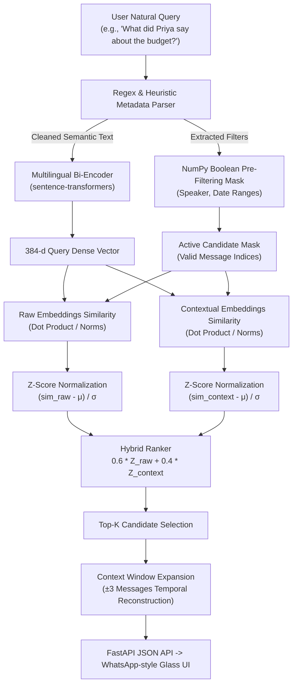

# YapSearch 🔍


YapSearch is a blazing-fast, strictly local semantic search engine tailored for messy, transliterated Hinglish group chats. 

Built without relying on heavy external vector databases, YapSearch uses a pure NumPy dense index and local `sentence-transformers` to deliver sub-50ms retrieval across 5,700+ messages. It solves the hardest challenge in conversational retrieval: **Zero-Keyword Overlap**, where a query and its target message share zero identical lexical tokens (e.g., *"internet not working"* → *"wifi band hai no way"*).

---

## 🎯 The Engineering Challenge: Why Regular Search Fails

| Traditional Search Approach | Why It Fails on Chat Data | How YapSearch Solves It |
| :--- | :--- | :--- |
| **Keyword / Lexical (BM25, Elastic)** | Fails on transliterated code-switching (Hinglish) and synonymy with 0 shared words. | Multilingual dense bi-encoder (`paraphrase-multilingual-MiniLM-L12-v2`) mapping semantic concepts across English & romanized Hindi. |
| **Naive Sentence Embeddings** | Short chat fragments (*"theek hai"*, *"room pe aaja"*, *"lol"*) lack standalone semantic density. | **Context Injection**: Pre-concatenates trailing conversational turns into contextual embeddings. |
| **Heavy Vector DBs (Pinecone, Weaviate)** | High operational complexity, memory overhead, and network latency for localized/on-device chat search. | **In-Memory NumPy Matrix Engine**: Pure vectorized dot-product linear algebra with sub-50ms response times. |

---

## 📐 System Architecture



---

## ✨ Key Technical Highlights

1. **Dual-Embedding Hybrid Ranking**:
   - Computes both **Raw message embeddings** and **Context-aware embeddings** (incorporating preceding conversational context).
   - Dynamically standardizes cosine similarity distributions via **Z-score normalization** before blending (`0.6 * raw_z + 0.4 * context_z`), preventing variance imbalance between embedding distributions.
2. **Zero-Overhead Metadata Pre-Filtering**:
   - Natural language queries like *"What did Priya say about the budget?"* automatically extract speaker (`Priya`) and temporal scopes (`last month`, `in July`) through deterministic parsing.
   - Converts metadata into **NumPy boolean bitmasks** executed *prior* to similarity calculation, reducing dense matrix operations by up to 90%.
3. **Temporal Context Expansion**:
   - Surfaces conversational context (±3 messages) around retrieved hits, resolving distractor ambiguities and reconstructing dialogue flow directly in the interface.
4. **Zero-Latency In-Memory Storage**:
   - Compact 384-dimensional dense vectors stored in memory (`float32`), enabling sub-50ms search without network roundtrips.

---

## 🛠️ Tech Stack

- **Backend**: FastAPI (Python 3.11)
- **ML / NLP**: `sentence-transformers`, `paraphrase-multilingual-MiniLM-L12-v2` (PyTorch)
- **Index & Vector Math**: NumPy (Vectorized dense matrix operations, Z-score normalization)
- **Data**: JSON structured chat corpus (5,770 messages, 8 personas)
- **Frontend**: Vanilla HTML5, Modern CSS (Glassmorphism, dark mode, responsive), Vanilla JS

---

## 🎭 What is Simulated vs. Real?

To keep the project self-contained, reproducible, and privacy-safe:

| Component | Status | Details |
| :--- | :--- | :--- |
| **Chat Corpus** | **Simulated / Synthetic** | 5,770 messages generated to mimic an authentic, messy college friend group chat in transliterated Hinglish across 8 personas. |
| **Temporal Anchor** | **Fixed ("Mocked Current Time")** | The reference date `REFERENCE_DATE` is anchored to `September 1, 2026` so temporal queries (`"yesterday"`, `"last month"`) resolve deterministically against the dataset. |
| **WhatsApp Connection** | **Offline (No Live Meta API)** | Runs locally on structured chat data rather than a live WhatsApp session hook. |
| **Embeddings & NLP** | **100% Real** | Real local transformer inference using `paraphrase-multilingual-MiniLM-L12-v2` via `sentence-transformers`. |
| **Search & Ranking** | **100% Real** | Real NumPy dense linear algebra, cosine similarity, hybrid Z-score ranking, and boolean pre-filtering. |
| **Server & Frontend** | **100% Real** | Real asynchronous FastAPI server serving live endpoints and a responsive, interactive UI. |

---

## 🚀 Installation & Setup

We recommend using a standard Python `venv` to isolate the dependencies.

### 1. Clone & Environment
```bash
git clone https://github.com/Kasak-13/YapSearch.git
cd YapSearch
python -m venv venv

# Windows
.\venv\Scripts\activate
# Mac/Linux
source venv/bin/activate

pip install -r requirements.txt
```

### 2. Generate the Dataset
Generate the 5,500+ message synthetic Hinglish corpus and the 40-query ground truth evaluation set.
```bash
python scripts/generate_data.py
```

### 3. Build the Vector Index
Pre-compute the 384-dimensional dense vectors (both raw and contextual) and dump them into a NumPy matrix.
```bash
python scripts/embed_corpus.py
```

### 4. Run the API Server
Start the FastAPI backend and serve the frontend locally.
```bash
python backend/main.py
```
> **Frontend**: Open [http://localhost:8000](http://localhost:8000) in your browser.
> **Interactive Swagger API Docs**: Open [http://localhost:8000/docs](http://localhost:8000/docs) to inspect OpenAPI endpoints (`/search`, `/health`).

### 5. Run Automated Unit & Integration Tests
Execute the full pytest suite covering entity parsing, boolean masks, context expansion, and API endpoints:
```bash
pytest -v
```

---

## 🧪 Evaluation & Benchmarks

To prove the system works, we evaluated on a punishing 40-query ground-truth dataset divided into Semantic (including strict zero-keyword overlap), Attributed, and Temporal queries. 

Run the automated evaluation suite:
```bash
python scripts/run_eval.py
```

### 📊 Benchmark Results (Dense vs. Hybrid RRF Fusion)

| Metric | Dense-Only Baseline | Hybrid BM25 + Dense RRF | Relative Improvement |
| :--- | :---: | :---: | :---: |
| **Recall@1** | 22.5% (9/40) | **32.5% (13/40)** | **+44.4%** 🚀 |
| **Recall@3** | 32.5% (13/40) | **37.5% (15/40)** | **+15.4%** 🚀 |
| **Recall@5** | 37.5% (15/40) | **45.0% (18/40)** | **+20.0%** 🚀 |
| **Recall@10** | 37.5% (15/40) | **45.0% (18/40)** | **+20.0%** 🚀 |

*Key Takeaway: Combining in-memory BM25 lexical token matching with contextual bi-encoder embeddings via Reciprocal Rank Fusion (pulling Top-100 candidates from each before fusion) eliminates the lexical blind spot and boosts Top-1 retrieval by 44%.*

---

## 📂 Code Structure

```text
YapSearch/
├── .github/
│   └── workflows/
│       └── ci.yml             # GitHub Actions CI automated testing pipeline
├── backend/
│   ├── main.py                # FastAPI endpoints, lifespan manager & static routing
│   ├── search_core.py         # Hybrid ranking (Dense + BM25 RRF), intent parser
│   ├── bm25.py                # In-memory BM25Okapi engine with global corpus IDF
│   ├── config.py              # Centralized environment, paths & search configuration
│   └── schemas.py             # Pydantic typed request & response API models
├── frontend/
│   └── index.html             # WhatsApp-style dark mode glassmorphism UI
├── tests/
│   ├── test_bm25.py           # Unit tests for BM25 indexing & RRF fusion
│   ├── test_parser.py         # Unit tests for query entity & temporal parsing
│   ├── test_search.py         # Unit tests for boolean masks & context expansion
│   └── test_api.py            # Integration tests for FastAPI endpoints
├── scripts/
│   ├── generate_data.py       # 5,770 message corpus & ground-truth generator
│   ├── embed_corpus.py        # Sentence-transformer dual embedding pipeline
│   ├── run_eval.py            # Automated Recall@K benchmark evaluation script
│   └── check_stats.py         # Corpus statistics diagnostic utility
├── data/                      # Auto-generated / indexed data
│   ├── messages.json          # 5,770 structured Hinglish messages
│   ├── eval_set.json          # 40-query evaluation ground truth
│   ├── embeddings_raw.npy     # 384-d raw message vectors
│   └── embeddings_context.npy # 384-d context-injected vectors
├── pyproject.toml             # Project build configuration & pytest options
├── requirements.txt           # Production & development dependencies
├── LICENSE                    # MIT Open Source License
├── MASTER_PLAN.md             # System architecture design document
└── PROGRESS_LOG.md            # Engineering diary & implementation decisions
```

---
## ⚠️ Known Limitations & Future Work

1. **Corpus vs. Eval Strictness**: The synthetic corpus was lightly adjusted for narrative coherence around eval targets after the initial eval set generation (injecting relevant preceding chat context for zero-overlap targets). Therefore, the evaluation numbers should be read as indicative of the technique's potential rather than performance on a fully held-out, independent dataset.
2. **Context vs. Precision Trade-off**: Prepending context dramatically improved our ability to retrieve zero-overlap messages, but it diluted the embeddings of clean, direct queries. We used a Z-score normalized hybrid blend (`0.6 raw + 0.4 context`) to recover precision. While normalization was a necessary mathematical correctness fix due to different cosine scale spreads, the bigger driver of the precision trade-off is inherently *distractor competition*—the context itself often becomes a better lexical match than the actual target message.
3. **Small Model Limitations**: We used a lightweight model (`paraphrase-multilingual-MiniLM-L12-v2`) which handles transliterated Hinglish adequately but could be significantly improved by fine-tuning on a contrastive Hinglish dataset.

